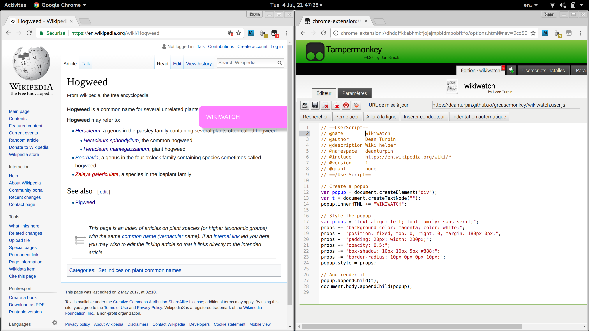

# Greasemonkey versus Tampermonkey

These scripts are used by a JavaScript injection plugin. I've used
Greasemonkey in Firefox and Tampermonkey with Chrome. They're the same sort of
thing but I prefer the Chrome/TM combination. The editor's less quirky, has good
error highlighting and I like how it keeps everything in tabs. The main
Greasemonkey annoyance for me is saving: you can happily save your work to
another location but the editor is then editing the saved location, not the live
version in the browser.

# Workflow

I'm really pleased with this workflow: snapping the page we're updating to one
side and the Tampermonkey editor to the other. I'm running Ubuntu Gnome.

# Resources

- http://commons.oreilly.com/wiki/index.php/Greasemonkey_Hacks/Getting_Started
- [My Greasemonkey template](https://github.com/deanturpin/templates/blob/master/greasemonkey-popup.user.js)
